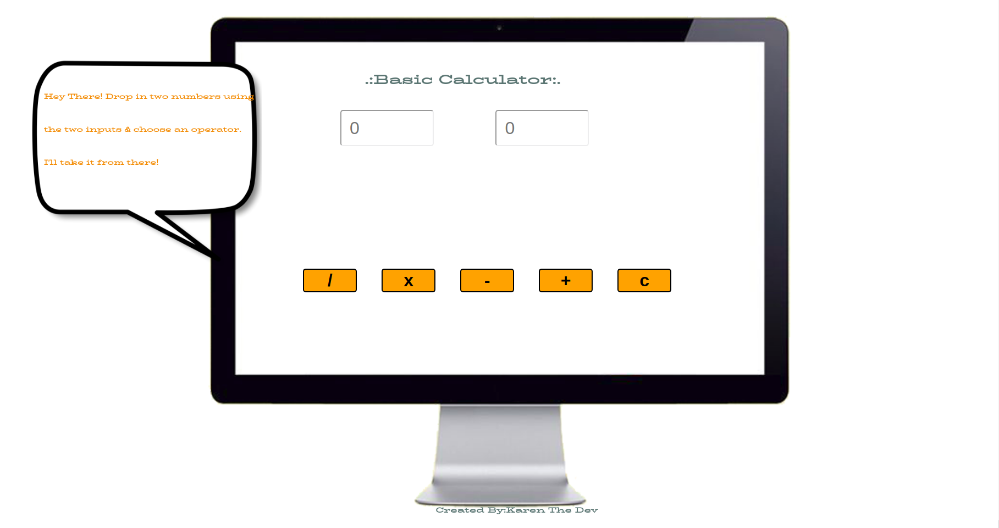

## A Basic Calculator App By Yours Truly

I developed a basic calculator!
1. Use the input fields to enter numbers
2. Select the Operator to act between the two inputs
3. Hit the Clear button to delete both inputs or simply click and type.

## Languages Used

1. JavaScript
2. HTML
3. CSS

## Improvements to Be Made:

With more time I would make this app fully responsive to for all devices.
